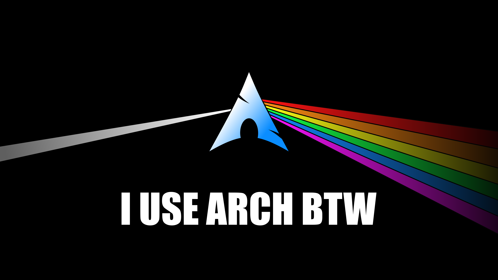
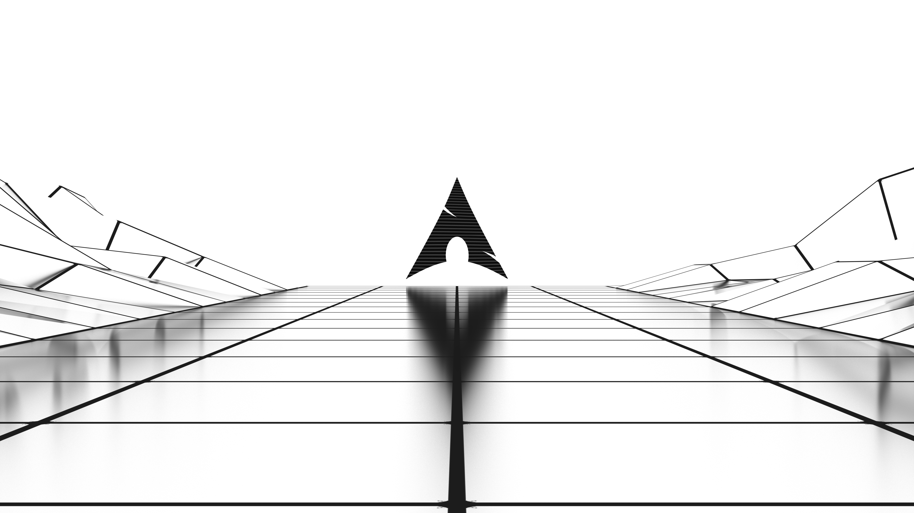
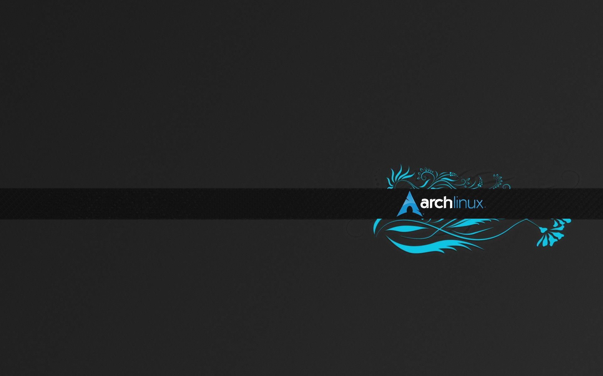
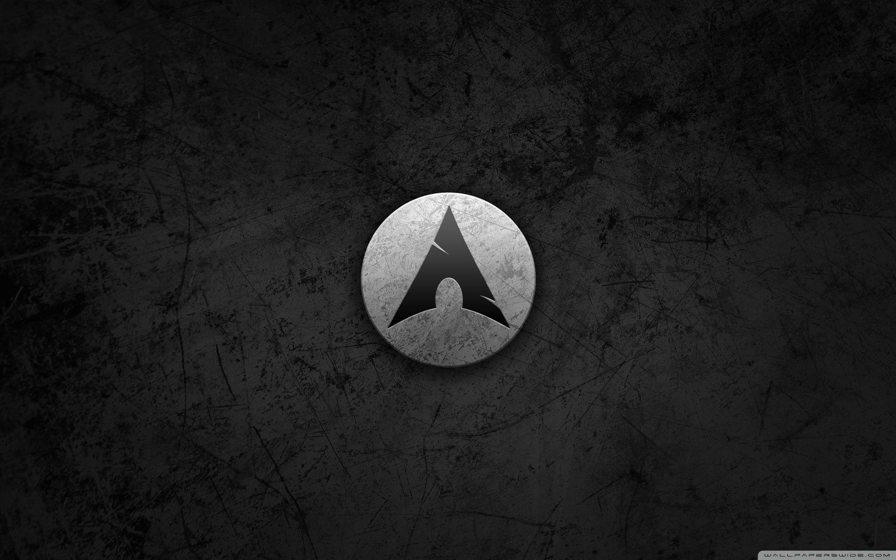
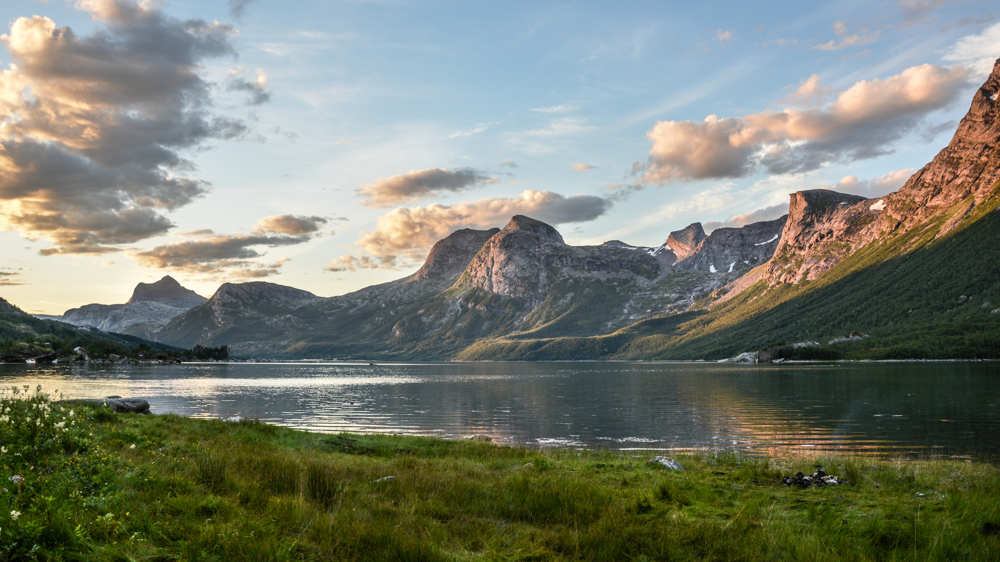

# Háttérképek index fájl

###### 7 képfájl található a gyűjteményben.

Háttérkép|Adatok
---------|------
|*Fájlnév:* NAGYBETU.PNG *Méret:* 818.08 KB *Dimenzió:* 1920*1200 pixel
|*Fájlnév:* archbtw.png *Méret:* 358.75 KB *Dimenzió:* 5120*2880 pixel
|*Fájlnév:* archwaveinv.png *Méret:* 968.93 KB *Dimenzió:* 5120*2880 pixel
|*Fájlnév:* blueflower-arch-wallpaper.jpg *Méret:* 209.38 KB *Dimenzió:* 1920*1200 pixel
|*Fájlnév:* circle-arch-wallpaper.jpg *Méret:* 426.75 KB *Dimenzió:* 2560*1600 pixel
|*Fájlnév:* landscape.jpg *Méret:* 3.97 MB *Dimenzió:* 5120*2880 pixel
|*Fájlnév:* reflected.jpg *Méret:* 4.37 MB *Dimenzió:* 5120*2880 pixel
